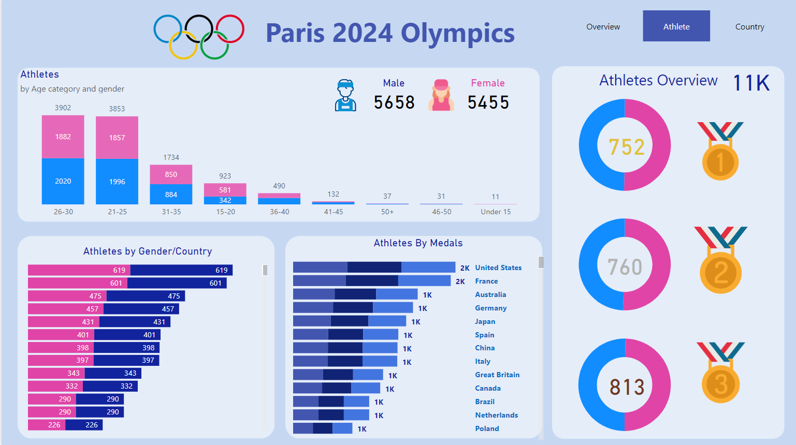
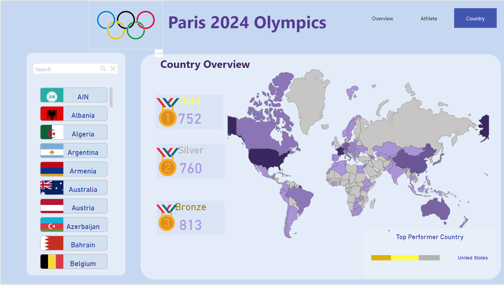
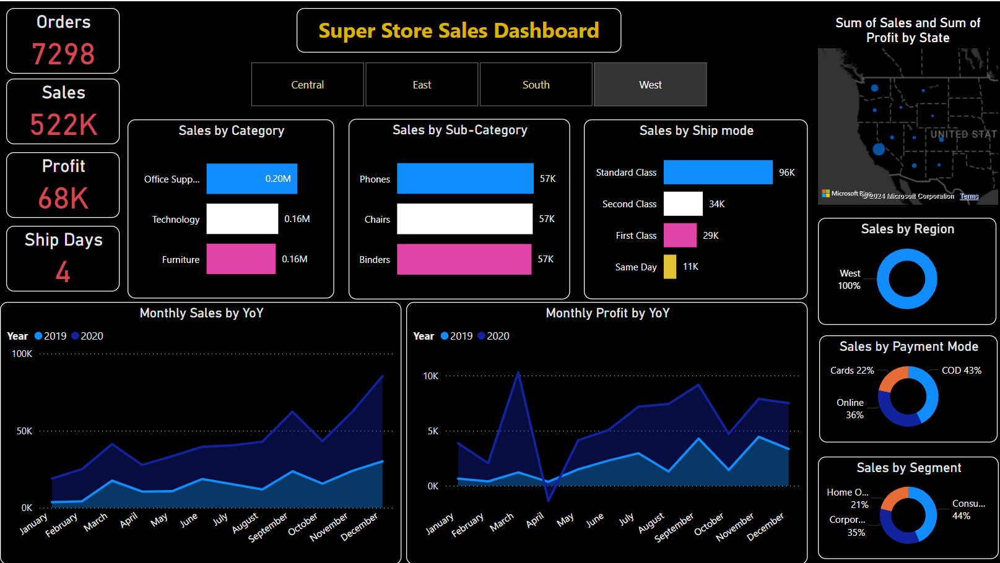
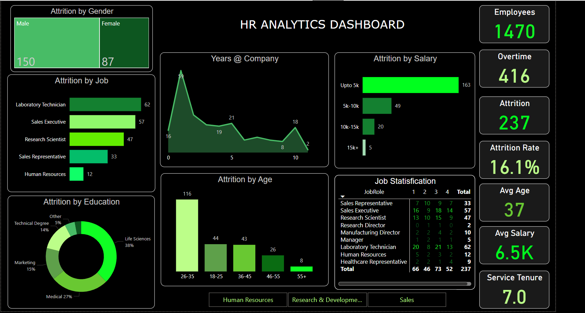
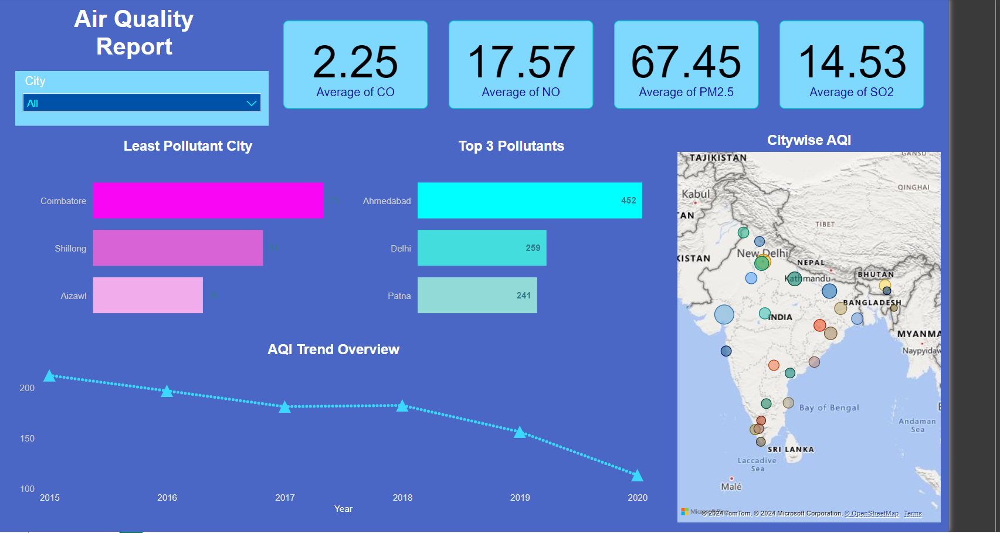

# PowerBi

### 📂 **Dataset:**

You can access the dataset used for dashboards [here](https://shorturl.at/M3dXa).

# 🏅 Paris 2024 Olympics Dashboard

This project visualizes the performance and participation data of athletes in the **Paris 2024 Olympics** using interactive charts and maps. The dashboard provides insights into key aspects such as medals won, gender distribution, and country-level statistics. 🚀

## 🔑 Key Features

- **🎖️ Medal Counts**: Track the number of Gold, Silver, and Bronze medals won by athletes.
- **👥 Gender Insights**: View a breakdown of athlete participation and medal distribution by gender.
- **🌍 Country Overview**: Explore the geographical distribution of medals and top-performing countries through an interactive map.
- **📊 Detailed Visuals**: Various graphs representing athlete performance by age, category, and country.

## 📌 Sections

1. **Overview**: A summary of overall performance and participation.
2. **Athlete Analysis**: Detailed breakdown of athletes by age, gender, and performance.
3. **Country Insights**: Medal and performance data for each participating country.

- 
- 
- 

## 🛒 Super Store Sales Dashboard 📊

This **Super Store Sales Dashboard** provides key insights into sales performance using interactive visualizations:
- **Total Orders**: 7,298 🛍️
- **Sales**: 522K 💵
- **Profit**: 68K 📈
- **Ship Days**: 4 🚚

### Features:
- **Sales by Category**: Office Supplies, Technology, Furniture 🖥️📂🛋️
- **Sales by Region, Payment Mode, and Ship Mode**: Analyze sales trends across regions, payment methods, and shipping classes 🌎💳📦
- **Year-over-Year Sales and Profit Analysis** 📆

- 

# 🧑‍💼 HR Analytics Dashboard

🚀 **Overview:**  
This dashboard visualizes key metrics related to employee attrition in an organization. It helps HR teams to gain insights into factors affecting employee turnover.

### 📊 **Key Features:**
- **Employees Overview:** Track the total number of employees (1470) and attrition rate (16.1%) 📈.
- **Attrition Insights:** Breakdown by gender, age, job roles, education, and salary.
  - 🧑‍🔬 Top job roles with attrition: Laboratory Technician (62), Sales Executive (57), etc.
  - 🎓 Education-wise breakdown, showing life sciences as the most common field.
- **Years at Company:** Displays tenure distribution, with higher attrition at early stages of employment.
- **Job Satisfaction:** See how different roles score on satisfaction, influencing attrition.

### 📅 **Additional Stats:**
- **Average Age:** 37 years.
- **Average Salary:** $6.5K.
- **Service Tenure:** 7 years.

 

---
# 🌍 Air Quality Report Dashboard

🚀 **Overview:**  
This dashboard provides an insightful visualization of air quality across various cities, focusing on key pollutants and trends over time.

### 📊 **Key Features:**
- **City-Wise AQI:** Displays air quality information across multiple cities with a map view 🌆.
- **Top 3 Pollutants:** Highlights the most polluted cities, with Ahmedabad leading at 452 🏙️.
- **Least Polluted Cities:** Includes cleaner cities like Coimbatore (73), Shillong (54), and Aizawl (35) 🌿.
- **Pollutant Averages:** 
  - **CO:** 2.25
  - **NO:** 17.57
  - **PM2.5:** 67.45
  - **SO2:** 14.53
- **AQI Trend Overview:** Shows the downward trend in AQI levels from 2015 to 2020 📉.
 

